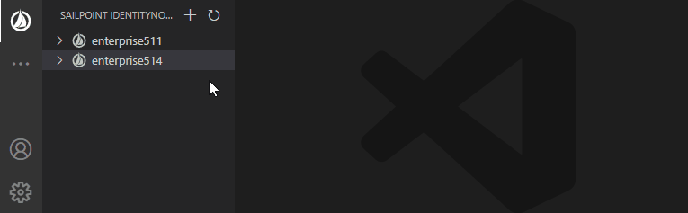
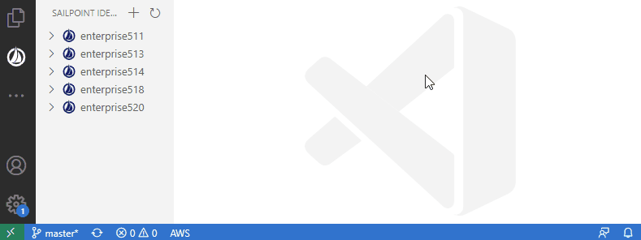
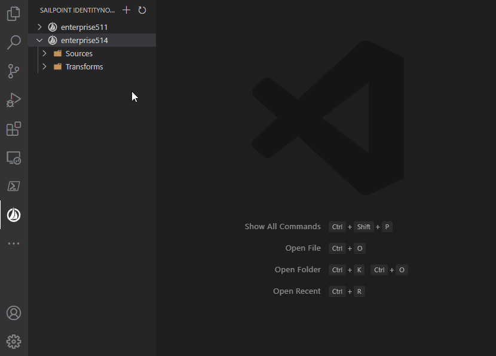

# SailPoint IdentityNow for Visual Studio Code

The SailPoint IdentityNow extension makes it easy to:

- edit, aggregate or reset sources
- create, edit, delete transforms
- create, edit, delete provisioning policy of a source
- create, edit, delete schemas of a source
- export config of a tenant

Several tenants can used at the same time

## Installation

The VSIX can be installed from the extension menu. Press `Ctrl`+`Shift`+`X` and in the menu, click `Install from VSIX...`.

## Add new tenant

The extension supports several tenants.

Open the **Command Palette** with `Ctrl+Shift+P` (Windows or Linux) or `Cmd+Shift+P` (macOS) to find the command "IdentityNow: Add tenant...".

Alternatively, you can click on the `+` in the SailPoint view.

## Export config of a tenant

In the SailPoint view, right-click on a tenant to export config.
Or, from the **Command Palette**, find the command "IdentityNow: Export config...".

## Extension Settings

At this moment, there is no configuration settings for this extension.

## Snippets

### Transforms

This extension includes the following snippets for transforms:

| Trigger            | Content                          |
| ------------------ | -------------------------------- |
| `tr-acc`           | Account Attribute                |
| `tr-b64-dec`       | Base64 Decode                    |
| `tr-b64-enc`       | Base64 Encode                    |
| `tr-concat`        | Concatenation                    |
| `tr-cond`          | Conditional                      |
| `tr-date-comp`     | Date Compare                     |
| `tr-date-format`   | Date Format                      |
| `tr-date-math`     | Date Math                        |
| `tr-diacritic`     | Decompose Diacritial Marks       |
| `tr-phone`         | E164 Phone                       |
| `tr-first`         | First Valid                      |
| `tr-rand-string`   | Generate Random String           |
| `tr-end`           | Get End of String                |
| `tr-refattr`       | Get Reference Identity Attribute |
| `tr-id`            | Identity Attribute               |
| `tr-indexof`       | Index Of                         |
| `tr-iso3166`       | ISO3166                          |
| `tr-last-index`    | Last Index Of                    |
| `tr-leftpad`       | Left Pad                         |
| `tr-lookup`        | Lookup                           |
| `tr-lower`         | Lower                            |
| `tr-norm`          | Name Normalizer                  |
| `tr-rand-alphanum` | Random Alphanumeric              |
| `tr-rand-num`      | Random Numeric                   |
| `tr-ref`           | Reference                        |
| `tr-replace`       | Replace                          |
| `tr-replace-all`   | Replace All                      |
| `tr-rightpad`      | Right Pad                        |
| `tr-rule`          | Rule                             |
| `tr-split`         | Split                            |
| `tr-static`        | Static                           |
| `tr-sub`           | Substring                        |
| `tr-trim`          | Trim                             |
| `tr-upper`         | Upper                            |
| `tr-uuid`          | UUID Generator                   |

### Schema

This extension includes the following snippets for schemas:

| Trigger         | Content             |
| --------------- | ------------------- |
| `New schema`    | Create a new schema |
| `New attribute` | Add new attribute   |

### Provisioning Policies

This extension includes the following snippets for schemas:

| Trigger                   | Content                          |
| ------------------------- | -------------------------------- |
| `New provisioning policy` | Create a new provisioning policy |
| `New field`               | Create a new field               |

## Known Issues

None

## Release Notes

### 0.0.3 

Workflows for ever!

- Export of tenant config
- Add support for workflows

### 0.0.2

Let's make transform great again!

- Add support for source schemas
- Add support for provision policies
- Add schema and snippets for source schemas
- Add schema and snippets for provisioning policies
- Add snippets for transforms

### 0.0.1

Initial internal release

- Add tenant with Personal Access Token (PAT) authentication
- Remove tenant
- Open Sources and Transforms
- Save Sources and Transforms
- Create Transform
- Remove Transform
